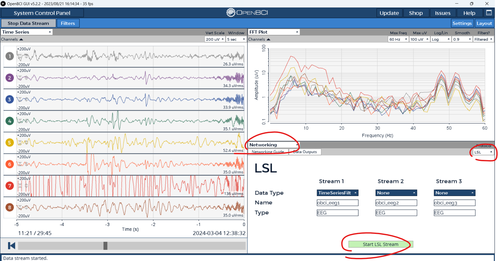
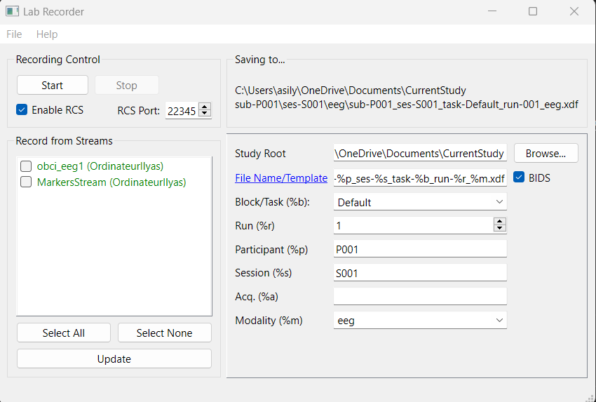

# EEG Motor Imagery using OpenGCI and Ultracortex Mark IV Headwear

We present a brain-computer interface (BCI) that interprets imagined movements by an individual. We focused on distinguish when the user is imagining moving his right arm from when the user is imagining moving his left arm. Subsequently, the designed system could be used to move an object through mere thought.

## Materials

All material used is open-source.

- [The OpenBCI GUI](https://github.com/OpenBCI/OpenBCI_GUI)

- [Ultracortex Mark IV](https://docs.openbci.com/AddOns/Headwear/MarkIV/)

- [LabRecorder] (https://github.com/labstreaminglayer/App-LabRecorder)

- OpenBCI [Cyton Board](https://shop.openbci.com/collections/frontpage/products/cyton-biosensing-board-8-channel?variant=38958638542&_gl=1*82g6ut*_ga*MTExMDkyMzU5OC4xNzA2Mzc5MTAy*_ga_HVMLC0ZWWS*MTcxMDc1MjY5MS4zOS4xLjE3MTA3NTQxNzAuMjguMC4w)

## Setup

For the Hardware Setup please refer to OpenBCI [doc](https://docs.openbci.com). You can choose to place the 8 electrodes near the motor cortex to attempt to achieve better results.

Install Lab Recorder, OpenBCI GUI and clone the git.

## Building tranning data

First start OpenBCI GUI and start the aquisition. If you have any trouble please refer to the [doc](https://docs.openbci.com/Software/OpenBCISoftware/GUIDocs/).

Once the signal aquired, start the live stream with the protocol LSL. 

On the other hand we need to have markers that tell us what to think. 
You can run the script after cloning the git repository: 

`python Calibration/ArmCalibration/calibrationLSLstringstream.py --sound --duration 4 --stream MarkersStream`
(You may need to `pip install pylsl` and `pip install pygame`)

Now if you open LabRecorder :

Select obci_eeg1 AND MarkerStream the click on Start button. You can chose the path for the record. The .xdf file created will be use as our database for trainning our ML model. For this exemple the file name is calibrationDataRightLeftArm4sec.xdf

## Testing and live testing

Next, everything is explain on the jupyter notebook : LSLclassification/lsl_motorImagery.ipynb

